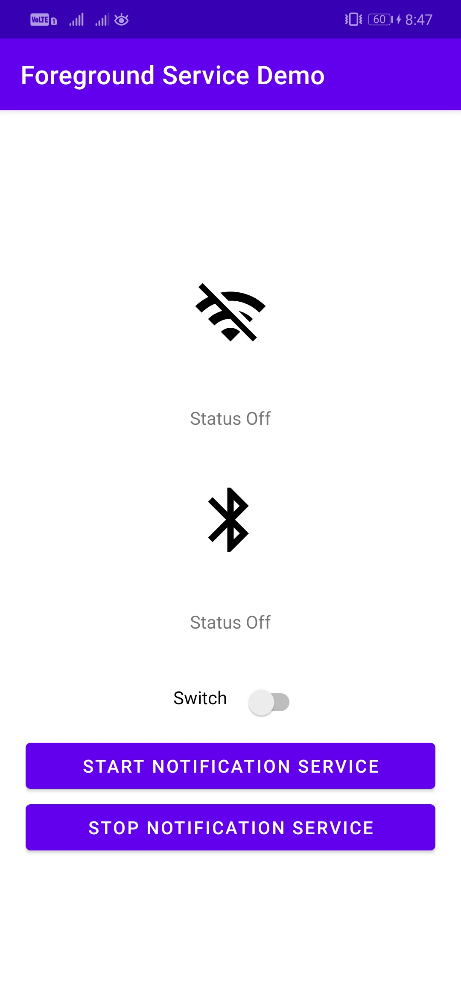
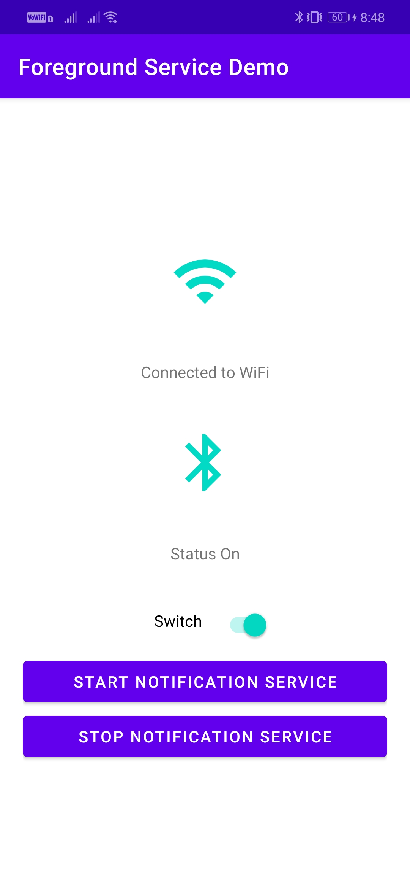

# Bluetooth-Network-Status
A simple android application that shows the current network and bluetooth status. It also shows the statuses in a persistent notification in system tray even after removing the app from recent list of apps.
## Screenshots
<p align="center">
  &nbsp;&nbsp;&nbsp;&nbsp;
  &nbsp;&nbsp;
</p>

## Class Diagram
<p align="center">
  
</p>

* MainActivity and NotificationService classes implement both BluetoothReceiverInterface and NetworkReceiverInterface.
* Activity/Service specific implementation of abstract function handleState() in the interfaces are provided.
* BluetoothReceiver and NetworkReceiver classes are BroadcastReceivers which update UI on receiving system events, through handleState() function in the interfaces mentioned above.

## Foreground Service - NotificationService
The crux of this application is the foreground service called NotificationService. This service keeps on running even if the app is removed from the recent apps list. Android OS lets the user know about the running app service by displaying a persistent notification in the system tray.  

```
    @Override
    public int onStartCommand(Intent intent, int flags, int startId) {
        Log.i(TAG, "onStartCommand()");
        bluetoothStatus = intent.getIntExtra("bluetoothStatus", R.string.status_off);
        addNotification();
        return START_NOT_STICKY;
    }
```
onStartCommand is called by the system every time a client explicitly starts the service by calling Context.startService(Intent). Returns START_NOT_STICKY constant which means if this service's process is killed while it is started (after returning from onStartCommand(Intent, int, int)), and there are no new start intents to deliver to it, then take the service out of the started state and don't recreate until a future explicit call to Context#startService. The service will not receive a onStartCommand(android.content.Intent, int, int) call with a null Intent because it will not be restarted if there are no pending Intents to deliver.

This mode makes sense for things that want to do some work as a result of being started, but can be stopped when under memory pressure and will explicit start themselves again later to do more work. An example of such a service would be one that polls for data from a server: it could schedule an alarm to poll every N minutes by having the alarm start its service. When its onStartCommand(Intent, int, int) is called from the alarm, it schedules a new alarm for N minutes later, and spawns a thread to do its networking. If its process is killed while doing that check, the service will not be restarted until the alarm goes off.

Following are the implementations of handleState() methods inside the BluetoothServiceInterface and NetworkServiceInterface:

```
    @Override
    public void handleBluetoothState(int state) {
        switch (state) {
            case BluetoothAdapter.STATE_OFF:
                bluetoothStatus = R.string.status_off;
                break;
            case BluetoothAdapter.STATE_TURNING_OFF:
                bluetoothStatus = R.string.status_turning_off;
                break;
            case BluetoothAdapter.STATE_ON:
                bluetoothStatus = R.string.status_on;
                break;
            case BluetoothAdapter.STATE_TURNING_ON:
                bluetoothStatus = R.string.status_turning_on;
                break;
        }
        addNotification();
    }

    @Override
    public void handleNetworkState(int state) {
        switch (state) {
            case NetworkUtil.TYPE_WIFI:
                networkStatus = R.string.wifi_on;
                break;
            case NetworkUtil.TYPE_MOBILE:
                networkStatus = R.string.mobile_data_on;
                break;
            case NetworkUtil.TYPE_NOT_CONNECTED:
                networkStatus = R.string.status_off;
                break;
        }
        addNotification();
    }

```
addNotification() method updates the notification content based on the network/bluetooth status, and starts a foreground service. Following is the implementation:

```
     private void addNotification() {
            Notification notification = new NotificationCompat.Builder(this, CHANNEL_ID)
                    .setStyle(new NotificationCompat.BigTextStyle().bigText("Bluetooth " + getText(bluetoothStatus) + "\nNetwork: " + getText(networkStatus)))
                    .setSmallIcon(R.drawable.ic_android)
                    .setContentIntent(pendingIntent)
                    .build();

            startForeground(1, notification);
        }
```
