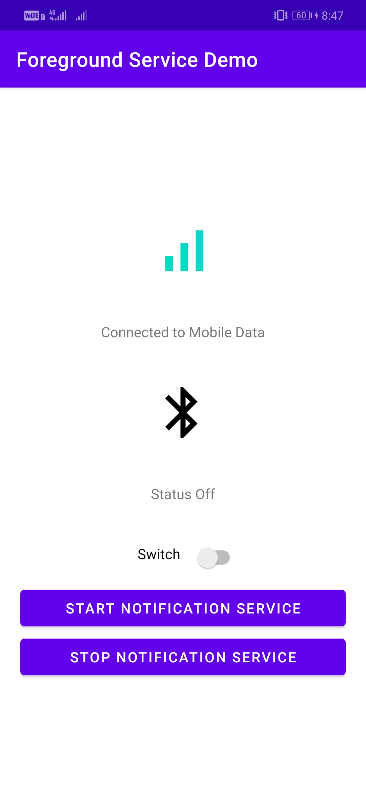

# Bluetooth-Network-Status
A simple android application that shows the current network and bluetooth status. It also shows the statuses in a persistent notification in system tray even after removing the app from recent list of apps.
## Screenshots

  &nbsp;&nbsp;&nbsp;&nbsp;
  &nbsp;&nbsp;

## Class Diagram

  

